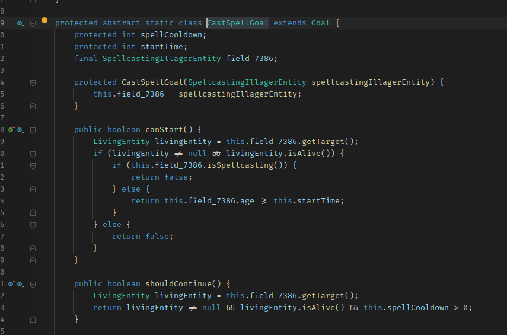

# Ecstatic

## Getting started
1. Add Basique's maven to the plugin repositories
```gradle
pluginManagement {
    repositories {
        maven {
            name = "FabricMC"
            url = uri("https://maven.fabricmc.net/")
        }
        maven {
            name = "Basique's maven"
            url = uri("https://porez.ml/maven")
        }

        mavenCentral()
        gradlePluginPortal()
    }
}
```
2. Add Ecstatic to the gradle project
```gradle
plugins {
    id "fabric-loom" version "0.9-SNAPSHOT"
    id "me.basiqueevangelist.ecstatic" version "0.1.1"
}
```
3. Configure classes to be made static
```gradle
ecstatic {
    targetedClasses.add 'net/minecraft/entity/mob/SpellcastingIllagerEntity$CastSpellGoal'
}
```
4. Profit!
